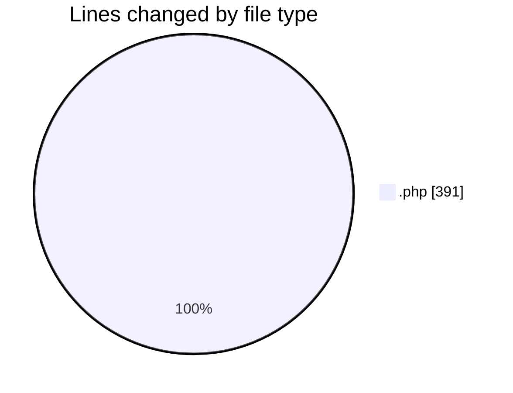
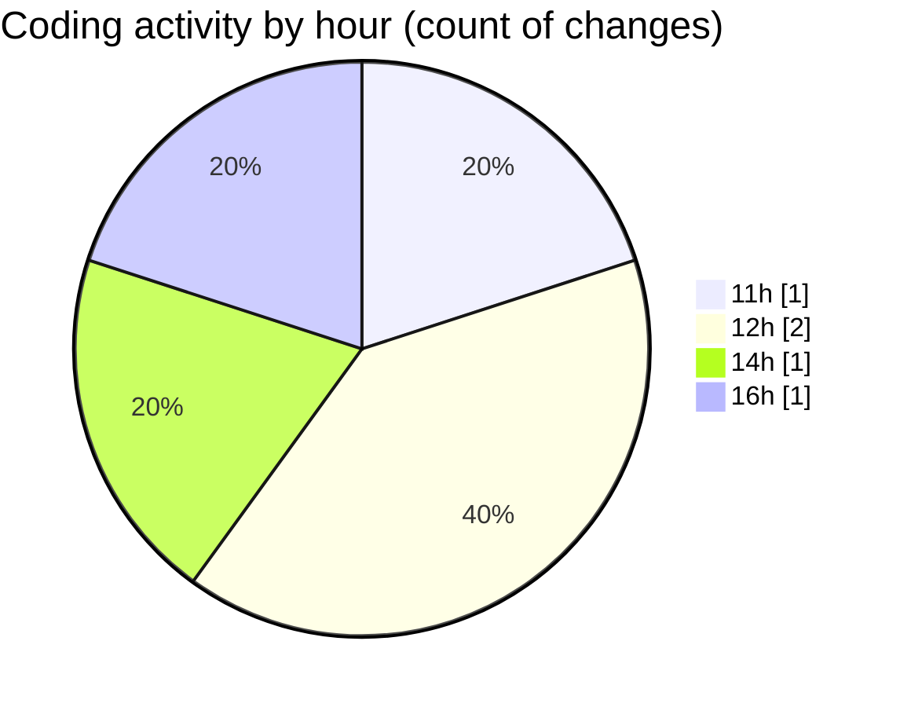

# Untitled (Workspace) - Activity Summary 

## Overall Statistics

| Stat                   | Value                                                             |
| ---------------------- | ----------------------------------------------------------------- |
| **Lines Added** (➕)   | 391                                          |
| **Lines Removed** (➖) | 0                                        |
| **Net Change** (↕)    | 391                |
| **Active Time** (⌚)   | 0 minute |

## Modified Files
- **jmb-geo-debug.php** (+48, -0)
- **jmb-geo-debug-run.php** (+72, -0)
- **jmb-geo-debug-run.php** (+72, -0)
- **jmb-geo-debug-temp.php** (+140, -0)
- **jmb-lvdp-tools.php** (+59, -0)

## Visualizations

### By File Type (Lines Changed)

### By Hour (Estimated Activity Count)

> **Last Updated:** 9/17/2026, 4:31:06 PM